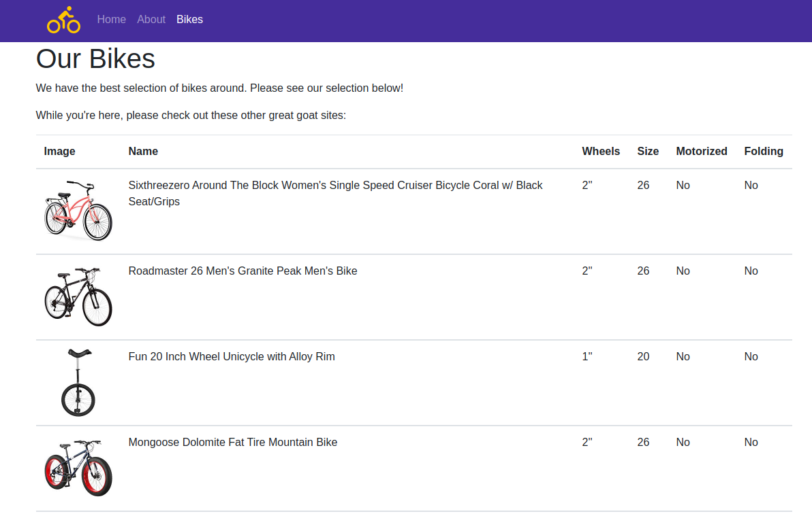
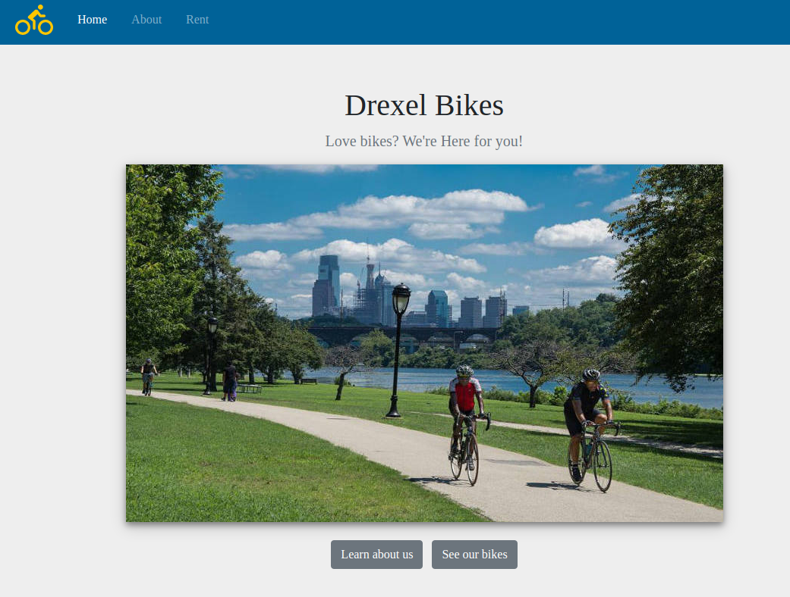
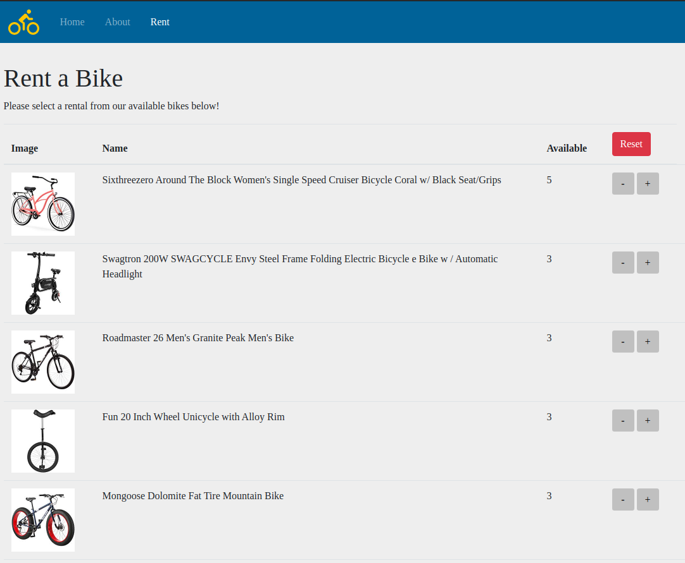
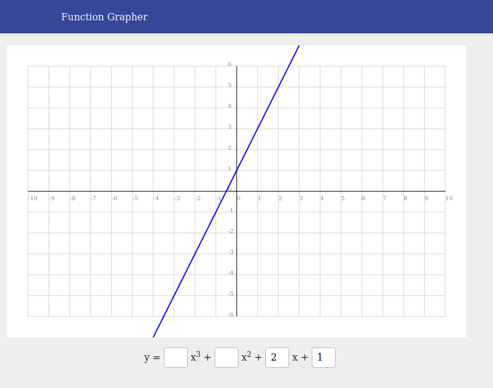
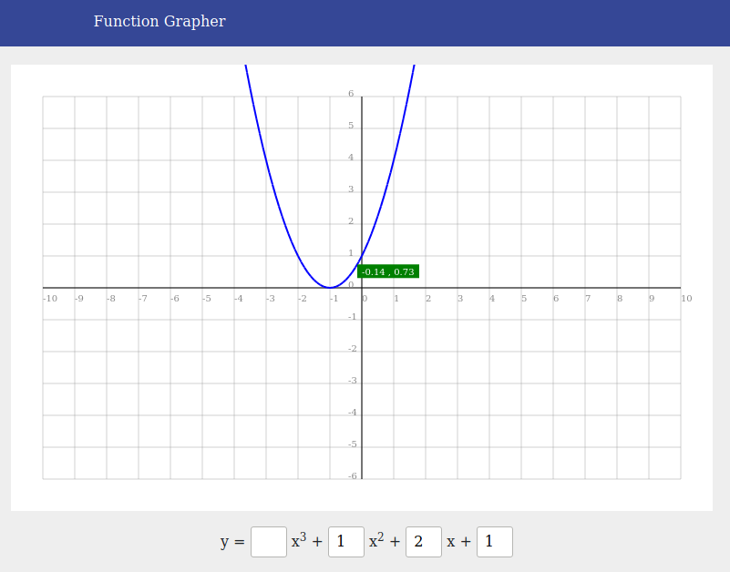
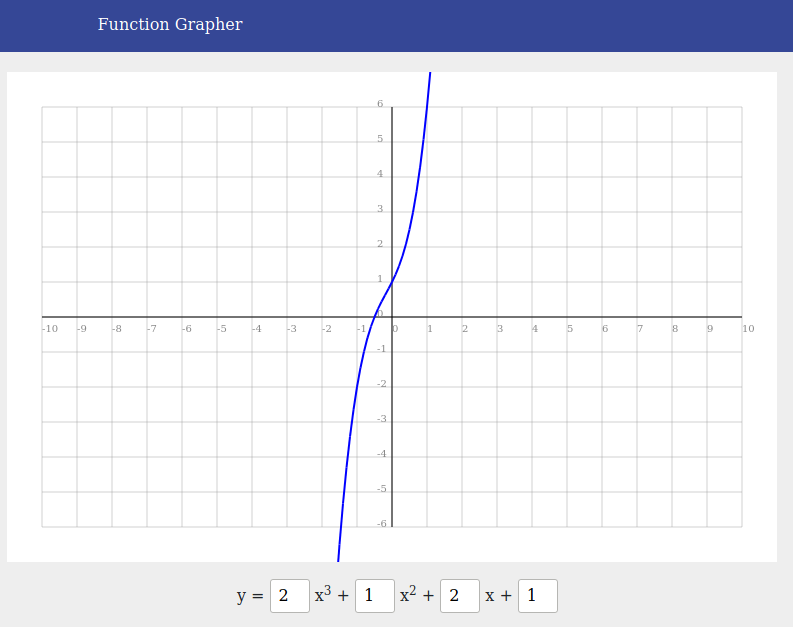
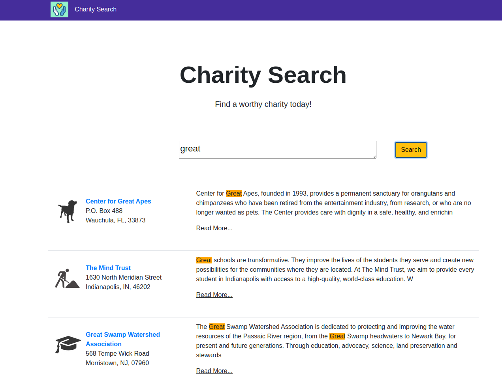
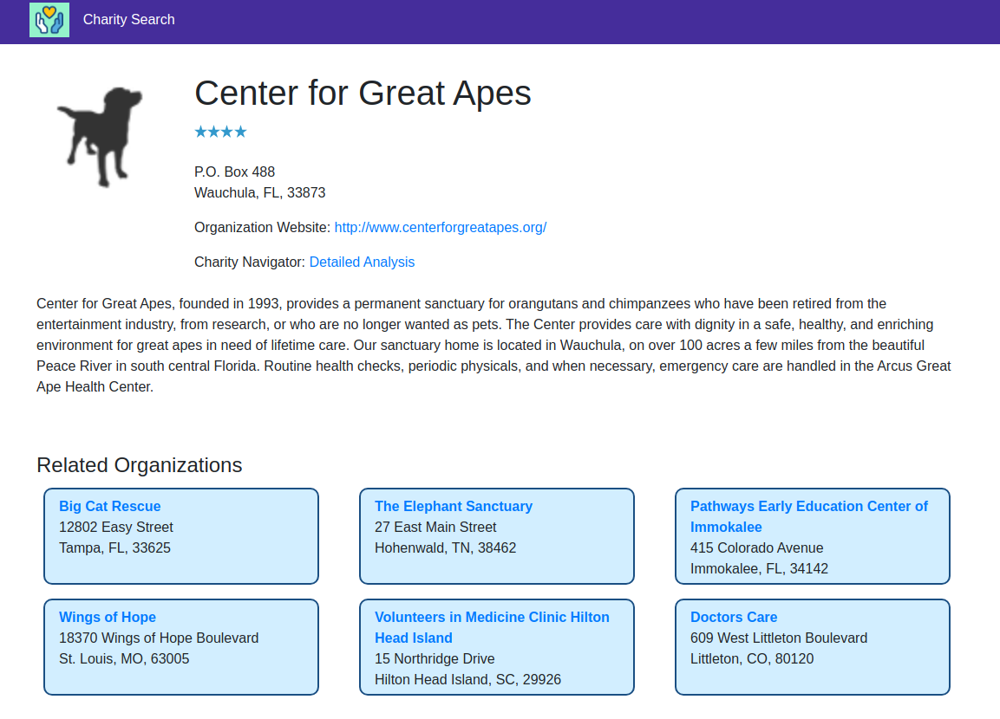
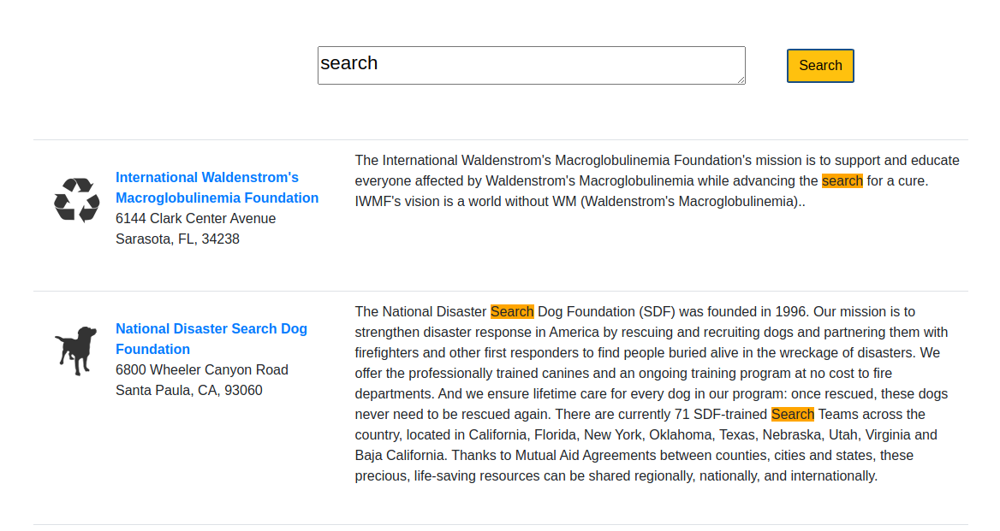

# HW1: Drexel Bikes

This project introduces the concept of server client architecture in the web. It uses a simple json file to send out data using REST endpoints. The UI consumes these APIs to display data in a dynamic way.

## Run Drexel Bikes
    > pip install -r ./hw1/requirements.txt
    > python3 run.py

## Results: 

#HW2: Drexel Bikes

This is a Flask, Javascript based project to book bicycles off the internet. This is a continuation of Drexel Bikes Static and adds a database to the previous project. With this extension, the Drexel Bike App can have dynamic information and storage ability. 

The intuition of the project is to introduce persistence into web app. This project made me further solidfy how data is accessed over the internet and how persistent changes are made over the web.

## Run Persistent Drexel Bikes 
    > pip install -r ./hw2/requirements.txt
    > python3 run.py

## Results:

# HW3: Function Grapher

This is a canvas based html application that is used to draw polynomial graphs. The application allows you to draw graphs of upto order 3, dynamically modify the graph when coeffs of the graph change and identify coordinates of points when user hovers over any x coordinate of the graph.

## Run Function Grapher
    > ./hw3/index.html

## Result:

# HW4: Charity Searcher

This is a text based search engine for finding your choice of charity to donate to. Use the searchbar to find the charities in the database that match the charity that contains searched text. The project uses `whoosh` python library to do the text search. Overall there are 4 RESTApis for the project. There are 4 REST Apis in this project: 2 that render the view and 2 that return search `json` data. One interesting feature of the project is that, your view highlights the text that matches your search query. 

The intuition of the project is to get acquanited with how something like text search works on the web.
your search query, to make it easy how you got the results.

## Run Charity Searcher
    > pip install -r ./hw4/requirements.txt
    > python3 run.py

# Result:

## Class Overview - CS530

Designing user interface class went over numerous aspects of user interface design. Each week, we were asked to work on a philosophical and research area in user interface design and comprehend aspects such as
1. What are the methodologies in the process? 
2. What areas of focus?
3. Why it is important for user interface design?
4. What are the shortcomings of the process?

The areas we looked into were
1. Rapid Prototyping
2. AI Driven User Interface
3. User Interface Evaluation methodologies among numerous other topics.

We also went into different areas of user interface design such as 1) Desktop Interface Design 2) Mobile Interface Design 3) Web Application Design 4) Non conventional user interface design (Kiosk, Vehicle UIs). Each of these examples, ended up with code examples and discussions of what the individual areas of the code are like. 

The assignments were a way to implement these ideas. The programming built on web interface design as this is a very prevalent form of development in the industry and concepts in this area can very easily be translated to other areas of user interface design.

 

